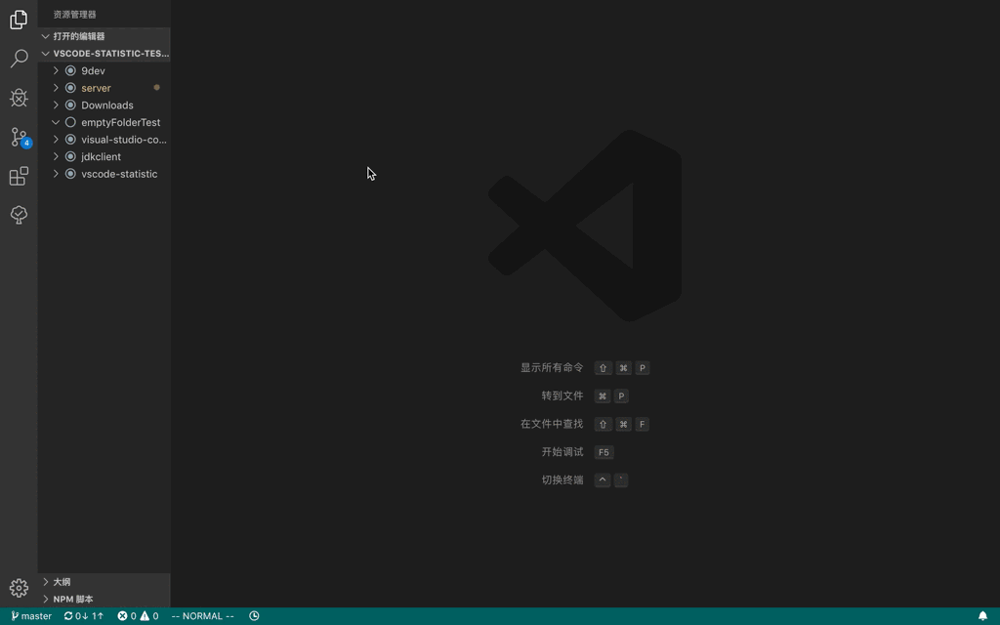

# vscode-statistic

代码行数统计工具

统计项目中所有的文本文件的行数，包括了所有行数、空行和注释行。
如果是非编程语言文件，比如 `.txt`，则没有注释行。

具有以下特点：

- 支持大部分编程语言；
- 数据结果可按需排序；
- 支持 VCS（目前为 Git 和 Hg），自动忽略不受 VCS 控制的文件；

*对于诸如 html 中嵌套 JS 和 CSS 等类型的文件，并不能正确统计其内嵌的 JS 和 CSS 的注释行，只会按照 html 的格式去统计注释行。*

目前支持以下本地化的内容：

- English
- 简体中文
- 繁体中文

## 用法

- 命令面板中输入 `statistic` 可找到所有的的命令；
- 在工作区(多项目)下，可以右键点键这个项目选择`显示项目统计`。
- 单项目中，可以右键点击项目中的任何文件均会出现`显示项目统计`。

## 版权

本项目采用 [MIT](https://opensource.org/licenses/MIT) 开源授权许可证，完整的授权说明可在 [LICENSE](LICENSE) 文件中找到。
