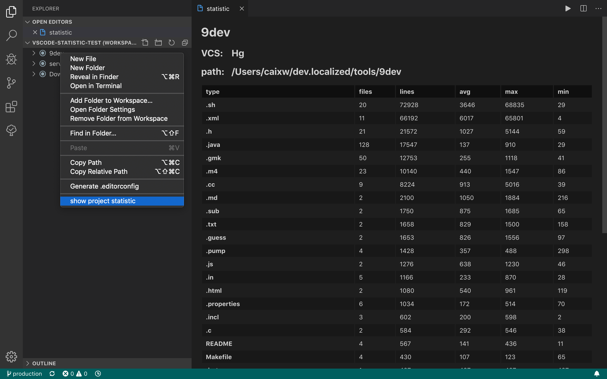

# vscode-statistic

代码行数统计工具

自动统计项目下的各类文件的行数信息，并归类显示。
如果项目是受 VCS 控制，则只统计受 VCS 控制的代码文件。

目前支持以下本地化的内容：
- en
- 简体中文

### 用法

- 命令面板中输入 `statistic` 可找到所有的的命令；
- 在工作区(多项目)下，可以右键点键这个项目选择`显示项目统计`。
- 单项目中，可以右键点击项目中的任何文件均会出现`显示项目统计`。

### 版权

本项目采用 [MIT](https://opensource.org/licenses/MIT) 开源授权许可证，完整的授权说明可在 [LICENSE](LICENSE) 文件中找到。
